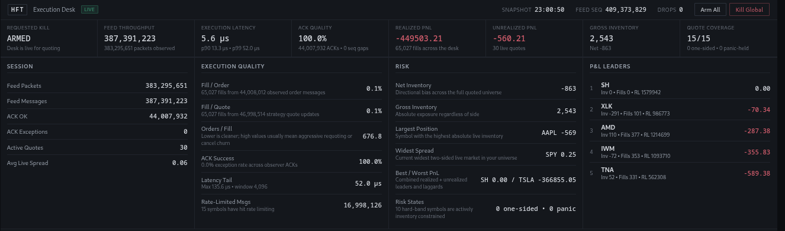
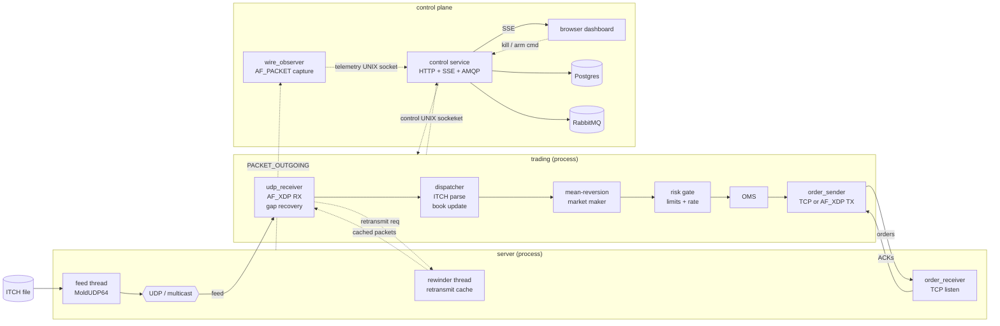
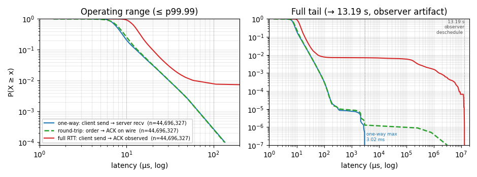
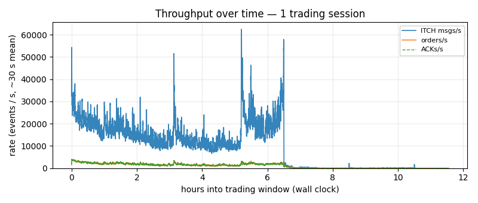
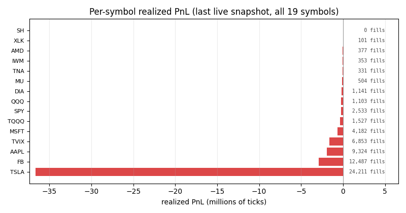

# HFT Replay Lab

Low-latency trading stack built around a replayed NASDAQ ITCH day: a simulated exchange, a fused trading binary, a passive wire observer, and a browser dashboard. Single host, ~6 KLOC, end-to-end.

It is an **engineering lab**, not a trading system. The market maker is a workload generator; the numbers worth reading are latency, throughput, and loss counters (see [Results](#results)) — not PnL.

## At a Glance



One full-day NASDAQ ITCH 30-Jan-2020 replay (i7-12700H, kernel 6.17, AF_XDP on `lo`, governor `powersave`):

| | |
|---|---|
| Engine `parse → send` | p50 **5.6 µs**  ·  p90 13.3 µs  ·  p99 52.0 µs  ·  max 135.6 µs |
| Feed observed         | 387 M ITCH msgs / 383 M packets |
| ACKs (1:1 with orders) | 44 M ACKs · **0** drops · **0** seq gaps · **0** bad checksums |
| Strategy diagnostics  | 17 M rate-limited requotes (RPS budget hit) |

Wire-side full round-trip (order on wire → matching ACK on wire), n = 44.7 M:
p50 **8.30 µs** · p99 30.86 µs · p99.9 70.32 µs · p99.99 133.77 µs · max 13.19 s.

The 13.19 s max is observer-side scheduling; the one-way client→server leg tops out at 3.02 ms.

## Architecture

Three runtime processes plus an optional control stack. Hot path:

```
ITCH file → server (feed) ──UDP/MoldUDP64──▶ AF_XDP RX ──▶ parse ──▶ book ──▶ strategy ──▶ risk ──▶ OMS ──▶ TX
                  ▲                                                                                    │
                  └──────────────────── TCP/AF_XDP order + ACK ◀────────────────────────────────────────┘
```



Process responsibilities:

- **`server`** — replays ITCH as MoldUDP64 over UDP, serves retransmits from a ring cache, accepts orders over TCP and emits ACKs.
- **`trading`** — AF_XDP receive with MoldUDP64 gap detection, in-place ITCH parse with SIMD shuffles, per-symbol order book, mean-reversion market maker, inline risk gate, OMS, and order egress (TCP or AF_XDP TX).
- **`wire_observer`** — passive `AF_PACKET` capture of `PACKET_OUTGOING`; reconstructs feed/order/ACK/health events and forwards them to the control service over a UNIX socket.
- **`control`** (Docker Compose) — Node.js HTTP API + SSE stream, RabbitMQ fanout, Postgres for low-rate persistence, daily append-only audit log.

Design choices that matter:

- XDP filter (`src/afxdp/xdp_filter.bpf.c`) redirects only the feed UDP port into AF_XDP — TCP order/ACK traffic goes through the normal kernel stack on the same interface.
- ITCH decode uses `PSHUFB` for A/F/E/X/C/D/U; one 16-byte shuffle replaces 3–5 scalar byte-swaps per message.
- MoldUDP64 gaps are detected in the trading path and recovered from the server rewinder.
- Allocations, logging, and command handling are pushed off the dispatcher core.

## Results

### Setup

- Date: 2026-05-15  ·  commit `36faf0a` (+ in-tree script/socket/path reorg)
- Dataset: `data/01302020.NASDAQ_ITCH50` (one full TotalView-ITCH 5.0 day)
- Replay: `HFT_SERVER_MODE=4` (timestamp-paced MoldUDP64), speed `1.0`
- RX: AF_XDP on `lo`, custom XDP filter on FEED_PORT
- TX: TCP (AF_XDP TX disabled on `lo`; code path is present for a real NIC)
- CPU: i7-12700H, cores pinned (server 2–3, trading 4–6, observer 7)
- Kernel: 6.17.10-100.fc41.x86_64  ·  GCC `-O3 -march=native -flto -mavx2 -mfma -mbmi2`
- Governor `powersave` (deliberately untuned)

### Latency

Wire-side (observer-measured), n = 44,696,327 acked orders over a 23 h window covering one full session plus warm-up / cool-down:

| Metric | Value |
| --- | --- |
| p50    | 8.30 µs |
| p90    | 13.30 µs |
| p99    | 30.86 µs |
| p99.9  | 70.32 µs |
| p99.99 | 133.77 µs |
| mean   | 11.35 µs |
| max    | 13.19 s (observer-side, see Notes) |



Per-leg breakdown:

| Leg | p50 | p99 | p99.9 | max |
| --- | --- | --- | --- | --- |
| in-binary `parse_to_send` (20 K snapshots) | 5.56 µs | 51.98 µs | 135.6 µs | 51.06 ms (worst 2 s window) |
| client send → server recv (one-way)         | 7.94 µs | 30.79 µs | 70.40 µs | 3.02 ms |
| full path order → ACK on wire               | 8.30 µs | 30.86 µs | 70.32 µs | 13.19 s |

### Throughput

| Metric | Value |
| --- | --- |
| feed packets       | 383,295,651 |
| ITCH messages      | 387,391,223 |
| orders sent        | 44,008,012  |
| ACKs received      | 44,007,932 (80 unacked at window end) |
| sustained ITCH/s during active trading | ~25–30 K |
| sustained orders/s during active trading | ~3 K |



### Loss & Strategy Health

| Metric | Value |
| --- | --- |
| dropped feed packets / ACK seq gaps / bad checksums | 0 / 0 / 0 |
| observer transport drops | 0 |
| retransmit requests issued | 0 (no gaps to recover; path verified, not load-tested) |
| quotes issued / fills | 46,998,514 / 65,027 |
| both-sided quote ratio | 67.18 % |
| rate-limited requotes (per-symbol RPS exhausted) | 16,998,126 |
| price-band / top-of-book / panic skips | 347,982 / 106 / 0 |
| realized PnL (ticks) | -44,950,321 (concentrated in TSLA at default knobs; see Notes) |
| max single-symbol \|inventory\| | 569 (over the 500 soft cap) |



### Methodology

- Sample window: full 23 h dashboard log (idle minutes contribute no records).
- Percentile: numpy `nearest`-rank on the 44.7 M-row population per leg. No sampling, no interpolation.
- Clock: `CLOCK_MONOTONIC` in the engine; `AF_PACKET` SO_TIMESTAMPNS in the observer; control service converts to ns since UNIX epoch on persist.
- Reproducibility: per-order data is published as 13 hourly `order_acks_*.csv.gz` chunks (~1.4 GB) on a GitHub Release; derived artifacts (`health`, `mm_stats`, `lat_stats`, `feed_per_sec`, `order_acks_per_minute`) live under `results/dashboard_20260515.compact/`.

### Notes

- **13 s max:** the engine one-way `client→server` leg tops out at 3.02 ms. The seconds-scale outlier comes from `clientSendTs → ackObserveTs`, where the observer's `AF_PACKET` thread is occasionally scheduled off-core — not from the trading process.
- **Strategy loss:** with `HFT_MM_HALF_SPREAD_TICKS=1` and `HFT_MM_INV_AVERSION=0.01`, the MM chases TSLA tick movement and bleeds spread. The chart exists as strategy diagnostics, not a P&L claim.
- **Headroom:** at ~27 K msgs/s ingest and ~3 K orders/s egress, the trading process is far from saturated. Tighter percentiles need host tuning (governor, `isolcpus`, hugepages, observer on an isolated core) — not code.
- **Next steps:** governor → `performance`; add `isolcpus=4-7 nohz_full=4-7 rcu_nocbs=4-7`; per-stage rdtsc inside the dispatcher; AF_XDP TX on a real NIC; sweep `HFT_MM_*` for the strategy.

## Technology Stack

- **Networking:** AF_XDP RX and (optional) TX; custom XDP/eBPF feed filter; `libxdp` + `libbpf`; MoldUDP64 replay + retransmit.
- **Hot path:** C11 + C++20; SSE4.1 `PSHUFB` ITCH decode; AVX2 IP/UDP checksum; vendored `third_party/orderbook` limit order book.
- **Discipline:** `pthread_setaffinity_np` core pinning; `mlockall(MCL_CURRENT | MCL_FUTURE)`; AF_XDP busy-poll where supported; hugepage-aware UMEM for TX.
- **Observability:** passive `AF_PACKET` capture; UNIX-socket telemetry + control; Node.js + SSE dashboard; RabbitMQ fanout; Postgres persistence.
- **Build:** CMake; Docker Compose for the control stack.

## Trading Model

- Universe is hard-coded in `include/hft/engine/universe.hpp`.
- Strategy: mean-reversion market maker in `include/hft/engine/strategy/mm_mean_reversion.hpp`.
- Fills are simulated from public prints in `include/hft/engine/sim/fill_sim.hpp`.
- Orders use the local wire protocol in `include/hft/protocol/wire.h`.

## Dashboard & Control

Operator panels: session cards, per-symbol matrix, execution quality, risk radar, order/ACK blotters, observer/transport health.

HTTP control endpoints:

- `GET  /api/state`
- `POST /api/command/kill-global`
- `POST /api/command/arm-all`
- `POST /api/command/kill-symbol`
- `POST /api/command/arm-symbol`

The trading process listens for the same actions on its local control socket:

- `kill_global`, `arm_all`, `kill_symbol <stock_locate>`, `arm_symbol <stock_locate>`

## Data

Replay needs a NASDAQ TotalView-ITCH 5.0 file at `data/01302020.NASDAQ_ITCH50` (or override via `HFT_SERVER_ITCH_FILE`). The protocol PDF lives alongside it. NASDAQ publishes both freely; this repository does not redistribute them — see [`data/README.md`](data/README.md).

## Build

Requirements: Linux, CMake ≥ 3.16, C11 + C++20, `libxdp`, `libbpf`, `libelf`, `zlib`, `pthread`. `clang` is needed to build the XDP filter object.

```bash
git submodule update --init --recursive
cd third_party/xdp-tutorial && ./configure && make lib && cd -
./scripts/build/all.sh
```

`make lib` builds `libbpf` + `libxdp` and installs them under `third_party/xdp-tutorial/lib/install/`; the project's CMake picks them up automatically. To use system `libxdp-dev` / `libbpf-dev`, point `-DXDP_TUTORIAL_ROOT=` at an existing built tree.

Per-target scripts: `./scripts/build/{server,trading,observer,stack}.sh`. Artifacts land in `build/bin/{server,trading,wire_observer}`.

Core-pinning knobs (CMake cache):

```bash
cmake -S . -B build -DCMAKE_BUILD_TYPE=Release \
  -DHFT_SERVER_FEED_CORE=2 \
  -DHFT_SERVER_ORDER_RECV_CORE=3 \
  -DHFT_CLIENT_UDP_RECV_CORE=4 \
  -DHFT_CLIENT_ORDER_SEND_CORE=5 \
  -DHFT_ENGINE_DISPATCH_CORE=6
```

Tuned one-shot bring-up (builds, applies host tuning, starts the stack):

```bash
sudo ./scripts/all.sh
```

This sets CPU affinity, SCHED_FIFO via `chrt`, transparent + reserved 2 MiB hugepages, memlock limits, and clears stale XDP attachments before launching.

## Run

```bash
./scripts/run/stack.sh      # optional: control + RabbitMQ + Postgres (Docker)
./scripts/run/server.sh
./scripts/run/trading.sh
./scripts/run/observer.sh
```

Dashboard at `http://localhost:8080`. After editing dashboard or control-service files:

```bash
docker compose up -d --build control
```

## Daily Audit Logs

With the control stack running, the control service appends a daily JSONL log to `results/dashboard_logs/dashboard_YYYYMMDD.txt`:

- `telemetry` — every dashboard-visible event (`feed`, `order`, `ack`, `health`, `mm_stats`, `lat_stats`) and operator commands.
- `order_ack` — correlated record per acked order with `symbol`, `side`, `qty`, `price`, `seq`, `msgType`, four ns-precision timestamps (`orderObserveTs`, `clientSendTs`, `serverRecvTs`, `ackObserveTs`), and three derived latencies.

Files run ~10 GB / trading hour. `scripts/utils/compact_dashboard_log.py` distills them into queryable CSVs (~62× compression).

## Repository Layout

- `apps/server/` — feed, order receiver, rewinder
- `apps/engine/` — fused trading dispatcher entrypoint
- `apps/client/` — AF_XDP RX and order-send threads (linked into `trading`)
- `apps/observer/` — passive wire observer
- `src/afxdp/` — AF_XDP RX/TX path and XDP filter
- `src/itch/` — ITCH parsing (SIMD)
- `src/engine/` — risk + OMS implementations
- `src/telemetry/` — local control socket + stats thread
- `include/hft/engine/` — universe, strategy, risk, fill sim, OMS interfaces
- `services/control/` — dashboard backend (Node.js)
- `dashboard/` — static frontend
- `scripts/build/` — per-target build scripts
- `scripts/run/` — per-component run scripts (`all.sh` is the tuned orchestrator)
- `scripts/utils/` — `top_symbols.py`, `bench_latency.sh`, `bench_report.py`, `compact_dashboard_log.py`

## Environment Variables

| Var | Purpose |
| --- | --- |
| `HFT_SERVER_MODE`            | replay mode for `server`; `4` = timestamp |
| `HFT_SERVER_SPEED`           | replay speed multiplier |
| `HFT_SERVER_ITCH_FILE`       | override the default ITCH file |
| `HFT_AFXDP_IFACE`            | AF_XDP interface (default `lo`) |
| `HFT_AFXDP_PREFER_SKB`       | loopback-friendly fallback (default `1`) |
| `HFT_AFXDP_FORCE_ZEROCOPY`   | request zero-copy when supported |
| `HFT_AFXDP_TX=1`             | switch order egress from TCP to AF_XDP TX |
| `HFT_DEADMAN_MS`             | enable the trading dead-man watchdog |
| `HFT_CONTROL_SOCKET`         | control socket path (default `run/hft-control.sock`) |
| `HFT_TELEMETRY_SOCKET`       | telemetry socket path (default `run/hft-telemetry.sock`) |
| `HFT_DASHBOARD_LOG_DIR`      | override the dashboard log directory |
| `HFT_MM_*`                   | strategy knobs — half-spread, EMA, RPS, inventory limits |

## Latency Benchmark

`scripts/utils/bench_latency.sh` produces a time-boxed, self-contained report under `results/bench_<ts>/`:

```bash
sudo ./scripts/utils/bench_latency.sh           # default: 15 s warm-up + 120 s window
sudo ./scripts/utils/bench_latency.sh 300       # 5-minute window
HFT_BENCH_ASSUME_RUNNING=1 ./scripts/utils/bench_latency.sh   # attach to a running stack
```

`report.md` / `report.json` cover: throughput (totals + per-second + peak 1 s order rate), loss (transport drops, ACK seq gaps, ACK checksum failures), latency percentiles for all four legs, CPU counters (`perf stat`: cycles/instructions/cache/branch/ctxt/page-faults plus derived IPC, cycles/order, ctxt-sw/s), process delta (RSS, hugetlb pages, I/O bytes, voluntary/involuntary ctxt switches), and a preflight snapshot of governor / `isolcpus` / hugepages / `perf_event_paranoid` / kernel/CPU.
